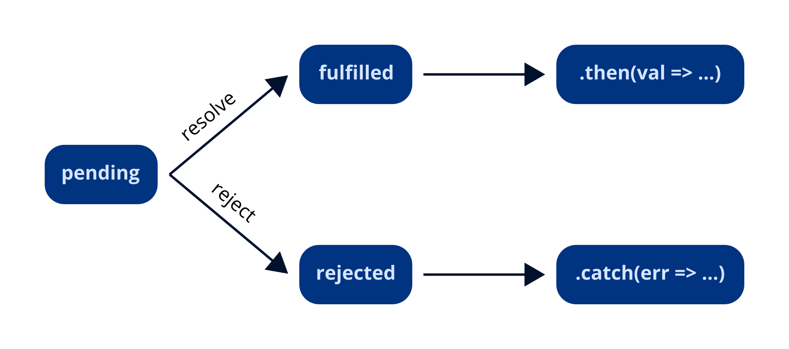
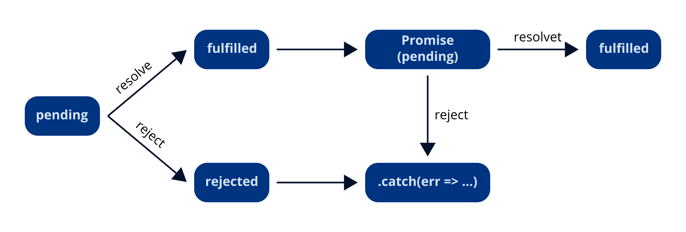

# Fundamentos de JavaScript

## Objetos del lenguaje

### Math

Math es un objeto incorporado que tiene propiedades y métodos para constantes y funciones matemáticas. No es un objeto de función.

A diferencia de los demás objetos globales, el objeto `Math` no se puede editar. Todas las propiedades y métodos de `Math` son estáticos. Usted se puede referir a la constante `pi` como `Math.PI` y puede llamar a la función _seno_ como `Math.sin(x)`, donde `x` es el argumento del método. Las constantes se definen con la precisión completa de los números reales en JavaScript.

Entre las propiedades y métodos mas utilizados tenemos:

- `Math.PI` Ratio de la circunferencia de un circulo respecto a su diámetro, aproximadamente 3,14159.
- `Math.abs(x)` Devuelve el valor absoluto de un número.
- `Math.floor(x)` Devuelve el mayor entero menor que o igual a un número.
- `Math.random()` Devuelve un número pseudo-aleatorio entre 0 y 1.
- `Math.round(x)` Devuelve el valor de un número redondeado al número entero más cercano.
- `Math.sqrt(x)` Devuelve la raíz cuadrada positiva de un número.
- `Math.trunc(x)` Devuelve la parte entera del número x, la eliminación de los dígitos fraccionarios.

### Otros métodos matemáticos

- `numObj.toFixed(digitos)` Devuelve una representación de cadena de `numObj` ; el valor de `digitos` es opcional. El número de dígitos que aparecen después del punto decimal; este puede ser un valor entre 0 y 20, inclusive.
- `numero.parseInt()` Devuelve la parte entera de un numero decimal.
- `numeroString.parseFloat()` Convierte una cadena de números a decimal.
- `palabra.toUpperCase()` Convierte una cadena de minúsculas a mayúsculas.

## Desestructuración de objetos

Otra forma de acceder a las propiedades de los objetos es por medio de la desestructuración de los mismos.

_Ejemplo:_

```jsx
let christian = {
  nombre: "Christian",
  apellido: "Ledesma",
  edad: 28,
};

//Podemos pasar directamente especificar la propiedad en los parametros
//function imprimirNombreEnMayusuclas({ nombre }) {
//	console.log(nombre.toUpperCase());
//}

//También la podemos desestructurar
function imprimirNombreEnMayusuclas(persona) {
  //let nombre = persona.nombre;
  let { nombre } = persona; //Forma desestructurada
  console.log(nombre.toUpperCase());
}

imprimirNombreEnMayusuclas(christian);
```

## Objetos como parámetros

JavaScript permite referenciar objetos en el retorno de la función.

_Ejemplo:_

```jsx
let christian = {
  nombre: "Christian",
  apellido: "Ledesma",
  edad: 28,
};

function cumpleanos(persona) {
  return {
    ...persona, //Por medio del operador de propagacion podemos referenciar objetos
    edad: persona.edad + 1,
  };
}

let christianMasViejo = cumpleanos(christian);
```

## Arrow functions

La forma de crear estas funciones es la siguiente: Primero definiremos la lista de parámetros, en caso de ser necesario, entre paréntesis seguido del símbolo => y las {} para indicar las instrucciones que se van a realizar.

Además de la sintaxis que es diferente a las anteriores este tipo de funciones tienen las siguientes características:

- Las "arrow function" no crean su propio contexto al ejecutarse. Al contrario que las "function expression" o las "function declaration" que crea su propio contexto.
- Las "arrow function" son anónimas.
- El objeto **arguments** no se encuentra en el contexto de la función.
- Si al definir la función no utilizamos el símbolo de las llaves. La función devolverá como resultado de la función el resultado de la ejecución de la instrucción que hayamos indicado.

_Ejemplo:_

```jsx
const saluda = (nombre) => {
  return `Hola ${nombre}`;
};

console.log(saluda("Victor")); //Se muestra en consola: Hola Victor

//Vamos a compactar un poco más el código.
const saluda2 = (nombre) => `Hola ${nombre}`;

console.log(saluda2("Victor")); //Se muestra en consola: Hola Victor
```

_Ejemplo 2:_

```jsx
let christian = {
  nombre: "Christian",
  apellido: "Ledesma",
  edad: 28,
};

const MAYORIA_DE_EDAD = 18;

let esMayorDeEdad = ({ edad }) => edad >= MAYORIA_DE_EDAD;

let mostrarEsMayorDeEdad = (persona) => {
  esMayorDeEdad(persona)
    ? console.log("${persona.nombre} es mayor de edad")
    : console.log("${persona.nombre} es menor de edad");
};
```

_Ejemplo 3 (Arrow function, Math.random y ciclo for):_

```jsx
let christian = {
  nombre: "Christian",
  apellido: "Ledesma",
  edad: 28,
  peso: 75,
};

const VARIACION_DE_PESO = 0.2;

const aumentaDePeso = (chris) => (chris.peso += VARIACION_DE_PESO);
const bajaDePeso = (chris) => (chris.peso -= VARIACION_DE_PESO);

const deNovioConFlor = (chris) => {
  for (let i = 0; i <= 365; i++) {
    let random = Math.random();
    if (random > 0.5) {
      aumentaDePeso(chris);
    } else if (random < 0.5) {
      bajaDePeso(chris);
    }
    console.log(christian.peso.toFixed(1));
  }
  console.log(
    `Despues de un año Christian pesa ${christian.peso.toFixed(1)}kg`
  );
};

deNovioConFlor(christian);
```

_Ejemplo 4 (Arrow function, Math.random y ciclo while):_

```jsx
let christian = {
  nombre: "Christian",
  apellido: "Ledesma",
  edad: 28,
  peso: 85,
};

const VARIACION_DE_PESO = 0.2;
const META = christian.peso - 10;

let diasDeEntrenamiento = 0;

const aumentaDePeso = (chris) => (chris.peso += VARIACION_DE_PESO);
const bajaDePeso = (chris) => (chris.peso -= VARIACION_DE_PESO);
const comeMucho = () => Math.random() < 0.3;
const haceEjercicio = () => Math.random() < 0.4;

const entrenaDuro = (chris) => {
  while (chris.peso > META) {
    if (comeMucho()) {
      aumentaDePeso(chris);
    }
    if (haceEjercicio()) {
      bajaDePeso(chris);
    }
    diasDeEntrenamiento++;
  }
  console.log(
    `Christian entrenó ${diasDeEntrenamiento} dias para llegar a ${META}kg`
  );
};

entrenaDuro(christian);
```

### Filtrar un array (filter)

_Ejemplo 5 dada una lista de personas filtrar aquellas que superen la altura de 1.80mts:_

```jsx
const agustin = {
  nombre: "Agustin",
  altura: 1.9,
};

const gabriel = {
  nombre: "Gabriel",
  altura: 1.85,
};

const mariano = {
  nombre: "Mariano",
  altura: 1.7,
};

const pablo = {
  nombre: "Pablo",
  altura: 1.78,
};

const arrayPersonas = [agustin, gabriel, mariano, pablo];

const esAlto = ({ altura }) => altura >= 1.8;

const alturaFiltrada = arrayPersonas.filter(esAlto);

console.log(alturaFiltrada);
```

### Transformar un array (map)

_Ejemplo 6 dada una lista de personas con sus respectivas alturas pasar altura a cms:_

```jsx
const agustin = {
  nombre: "Agustin",
  altura: 1.9,
};

const gabriel = {
  nombre: "Gabriel",
  altura: 1.85,
};

const mariano = {
  nombre: "Mariano",
  altura: 1.7,
};

const pablo = {
  nombre: "Pablo",
  altura: 1.78,
};

const arrayPersonas = [agustin, gabriel, mariano, pablo];

//const alturaACms = (persona) => {
//	return {
//		...persona,
//		altura: persona.altura * 100
//	}
//}

/*Si el arrow function empieza con paréntesis puede devolver el objeto sin necesidad de hacer uso de return*/
const alturaACms = (persona) => ({
  ...persona,
  altura: persona.altura * 100,
});

const arrayPersonaCms = arrayPersonas.map(alturaACms);

console.log(arrayPersonaCms);
```

### Reducir un array a un valor (reduce)

_Ejemplo 7 dada una lista de personas y cantidad de libros que posee cada una, hacer una función que devuelva la cantidad total de todos los libros:_

```jsx
const juan = {
  nombre: "Juan",
  libros: 40,
};

const alejandro = {
  nombre: "Alegandro",
  libros: 68,
};

const felipe = {
  nombre: "Felipe",
  libros: 20,
};

const eduardo = {
  nombre: "Eduardo",
  libros: 55,
};

const arrayPersonas = [juan, alejandro, felipe, eduardo];

//var acum = 0
//
//for(i = 0; i < arrayPersona.length; i++) {
//		acum = acum + arrayPersonas[i].libros
//}

//const reducir = (acum, persona) => acum + persona.libros

const reducir = (acum, { libros }) => acum + persona.libros;

const totalDeLibros = arrayPersonas.reduce(reducir, 0);

console.log(`En total todos tienen ${totalDeLibros}`);
```

## Constructores de métodos

Cuando nos referimos a objetos en JavaScript estamos hablando de prototipos y no tanto de clases. Si bien en las nuevas versiones de JavaScript existe lo que son clases, no son exactamente como las podemos llegar a conocer en otros lenguajes. Pero si existen prototipos y como veremos estas "clases" terminan siendo en esencia prototipos.

Para entender de que se trata todo esto, vamos a empezar creando prototipos hasta llegar a lo que son las clases en JavaScript.

Vamos a empezar con el siguiente ejemplo:

```jsx
function Persona(nombre, apellido, edad) {
	this.nombre = nombre
	this.apellido = apellido
	this.edad = edad
}

const persona1 = new Persona('Christian', 'Ledesma', 28
```

Ahora si yo quisiera crear un método para este nuevo objeto lo podemos hacer de la siguiente forma:

```jsx
function Persona(nombre, apellido, edad, altura) {
  this.nombre = nombre;
  this.apellido = apellido;
  this.edad = edad;
  this.altura = altura;
}

Persona.prototype.saludar = function () {
  console.log(`Hola, me llamo ${this.nombre} ${this.apellido}`);
};

Persona.prototype.soyAlto = function () {
  return this.altura >= 1.75;
};

const persona1 = new Persona("Christian", "Ledesma", 28, 1.77);
const persona2 = new Persona("Florencia", "Guzman", 32, 1, 70);

persona2.saludar();
persona2.soyAlto();
```

Ahora si remplazamos en el código alguna de las funciones por una arrow function, y hacemos un `debugger` podremos observar que nuestro `this.` ya no forma parte al ámbito de nuestro objeto sino que `this.` **no es lo que esperábamos**.

```jsx
function Persona(nombre, apellido, edad, altura) {
  this.nombre = nombre;
  this.apellido = apellido;
  this.edad = edad;
  this.altura = altura;
}

Persona.prototype.saludar = () => {
  debugger;
  console.log(`Hola, me llamo ${this.nombre} ${this.apellido}`);
};

Persona.prototype.soyAlto = function () {
  return this.altura >= 1.75;
};

const persona1 = new Persona("Christian", "Ledesma", 28, 1.77);
const persona2 = new Persona("Florencia", "Guzman", 48, 1, 70);

persona2.saludar();
persona2.soyAlto();
```

### `this.` no es lo que esperábamos

En las arrow function cambian quien es `this.` dentro de la función. Ahora `this.` apunta al objeto global `window` . Si hacemos una comparación estricta `this === windows` veremos que no devuelve `true` .

## Clases

En JavaScript, la herencia no existe pero existe la herencia prototipal. En ECMAScript 2015 se introducen las **Clases** que son una mejora sintáctica sobre la herencia basada en prototipos. La sintaxis de las clases no introduce un nuevo modelo de herencia orientada a objetos, simplemente proveen una sintaxis mucho más clara y simple para crear objetos y lidiar con la herencia. Las clases son "funciones especiales", como las **expresiones de funciones** y **declaraciones de funciones**, la sintaxis de una clase tiene dos componentes: **expresiones de clases** y **declaraciones de clases**.

A continuación rehacemos el ejemplo anterior utilizando la sintaxis de clases "**declaraciones de clases**":

```jsx
class Persona {
  constructor(nombre, apellido, edad, altura) {
    (this.nombre = nombre),
      (this.apellido = apellido),
      (this.edad = edad),
      (this.altura = altura);
  }

  saludar() {
    console.log(`Hola, me llamo ${this.nombre} ${this.apellido}`);
  }

  soyAlto() {
    return this.altura >= 1.75;
  }
}

const persona1 = new Persona("Christian", "Ledesma", 28, 1.77);
const persona2 = new Persona("Florencia", "Guzman", 48, 1, 70);

persona2.saludar();
persona2.soyAlto();
```

A continuación rehacemos el ejemplo anterior pero esta vez utilizando la sintaxis de clases "**expresión de clases**":

```jsx
const Persona = class {
  constructor(nombre, apellido, edad, altura) {
    (this.nombre = nombre),
      (this.apellido = apellido),
      (this.edad = edad),
      (this.altura = altura);
  }

  saludar() {
    console.log(`Hola, me llamo ${this.nombre} ${this.apellido}`);
  }

  soyAlto() {
    return this.altura >= 1.75;
  }
};

const persona1 = new Persona("Christian", "Ledesma", 28, 1.77);
const persona2 = new Persona("Florencia", "Guzman", 48, 1, 70);

persona2.saludar();
persona2.soyAlto();
```

## extends

La palabra clave extends es usada en la declaración o expresión de clases, para crear una clase hija de otra.

### Sintaxis

```jsx
class ChildClass extends ParentClass {
  constructor(parametro1, parametro2) {
    //Aquí se invoca el constructor de la clase padre.
    //En las clases extendidas, se debe llamar a super() antes de poder usar 'this'.
    //El no hacerlo provocará un reference error.
    super(parametro1, parametro2);
    //Con super() no es necesario reescribir los parametros con this.
    this.parametro3 = "Lo que sea";
  }
  //Métodos
}
```

Utilizando el ejemplo de la clase Persona, creamos una nueva clase llamada Desarrollador que hereda las propiedades de la clase Persona pero aparte tiene un nuevo parámetro llamado lenguaje y se modifica el método saludo():

```jsx
class Persona {
  constructor(nombre, apellido, edad, altura) {
    (this.nombre = nombre),
      (this.apellido = apellido),
      (this.edad = edad),
      (this.altura = altura);
  }

  saludar() {
    console.log(`Hola, me llamo ${this.nombre} ${this.apellido}`);
  }

  soyAlto() {
    return this.altura >= 1.75;
  }
}

class Desarrollador extends Persona {
  constructor(nombre, apellido, edad, altura, lenguaje) {
    super(nombre, apellido, edad, altura);
    this.lenguaje = lenguaje;
  }

  saludar() {
    console.log(
      `Hola, me llamo ${this.nombre} ${this.apellido} y soy desarrollador ${this.lenguaje}`
    );
  }
}

const persona1 = new Desarrollador(
  "Christian",
  "Ledesma",
  28,
  1.77,
  "JavaScript"
);
const persona2 = new Persona("Florencia", "Guzman", 48, 1, 70);

persona1.saludar();
persona2.saludar();
```

## Funciones como parámetros

Respondemos el saludo pasando una función por parámetro.

```jsx
class Persona {
  constructor(nombre, apellido, edad, altura) {
    (this.nombre = nombre),
      (this.apellido = apellido),
      (this.edad = edad),
      (this.altura = altura);
  }

  saludar(fn) {
    //console.log(`Hola, me llamo ${this.nombre} ${this.apellido}`)

    //let nombre =  this.nombre
    //let apellido =  this.apellido
    let { nombre, apellido } = this;
    console.log(`Hola, me llamo ${nombre} ${apellido}`);
    if (fn) {
      fn(); //Como le paso el fn() esDev equivale a false
    }
  }

  soyAlto() {
    return this.altura >= 1.75;
  }
}

class Desarrollador extends Persona {
  constructor(nombre, apellido, edad, altura, lenguaje) {
    super(nombre, apellido, edad, altura);
    this.lenguaje = lenguaje;
  }

  saludar(fn) {
    //let nombre =  this.nombre
    //let apellido =  this.apellido
    //let lenguaje =  this.lenguaje
    let { nombre, apellido, lenguaje } = this;

    console.log(
      `Hola, me llamo ${nombre} ${apellido} y soy desarrollador ${lenguaje}`
    );

    if (fn) {
      fn(true); //Como le paso true a la fn ejecuta la condicion del	responderSaludo
    }
  }
}

function responderSaludo(esDev) {
  if (esDev) {
    console.log(`Ah, mira vos, no sabía que eras desarrollador`);
  }
}

const persona1 = new Desarrollador(
  "Christian",
  "Ledesma",
  28,
  1.77,
  "JavaScript"
);
//const persona2 = new Persona('Florencia', 'Guzman', 48, 1,70)

//persona1.saludar()
//persona2.saludar()
persona1.saludar(responderSaludo);
```

## Call Stack

JavaScript tiene algo llamado **Call Stack** (en español pila de ejecución), que es en donde se van poniendo los _frames_ a medida que el el motor de JavaScript lee nuestro código y se encuentra con el llamado de una función, las funciones se van agregando según el orden de ejecución de nuestro programa. Si una función llama a otra se agrega un nuevo _frame_ al **Call Stack**. Estos **frames** son registros que contienen toda la información asociada de las funciones llamadas.

A las pilas también se las conoce como **LIFO** por sus siglas **Last in First Out** (el ultimo en entrar es el primero en salir). Como JavaScript solo puede ejecutar una sola cosa a la vez y como solo cuenta con una solo **Call Stack**, entonces la función que ejecutará va a ser la función asociada al _frame_ que se encuentra arriba de toda la pila, cuando termina de ejecutar esta función, ya sea porque llegó al final o se encontró con una instrucción de `return`, el motor va a sacar el _frame_ que se encuentra arriba de toda la pila y va a continuar trabajando con el _frame_ que quedó debajo y la función que este _frame_ tiene asociado. Cuando ejecutamos un programa en JavaScript la primera función que se agrega a la pila es una función anónima llamada `(anonymous)` que engloba a todo el programa, es como si fuera el hilo principal del programa y cuando esta función salga de la pila significa que termino la ejecución del programa principal.

La información que contienen un frame es:

- Nombre de la función.
- Archivo al que pertenece.
- N° de próxima línea a ejecutar,
- Contexto de ejecución: local, global, arguments.

**\*Arguments**: es una variable que nos devuelve un array con los parámetros que recibe la función que fue invocada. Las arrow function no lo tienen disponible. En la función (anonymous) que engloba todo nuestro programa no tenemos arguments porque todavía no se llamó a ninguna función, pero si tiene una referencia al objeto global, que en el caso de los navegadores se llama window y en el caso de Node.js se llama global.\*

Llevando este ejemplo a un snippet (fragmento de codigo) a la sección de source o fuente dentro de el inspeccionador de cualquier navegador, y agregando un breackpoint (punto de interrupción) en la línea del llamado a `hacerEnsaladaMixta();` podremos observar en el depurador como es que se van cargando los frames en la pila de llamada, pila de ejecución o Call Stack dependiendo del navegador que uses.

```jsx
function cortar(ingrediente) {
  console.log("Cortar " + ingrediente);
}

function mezclarIngredientes(n) {
  if (n <= 0) return;

  console.log("Mezclar #" + n);
  mezclarIngredientes(n - 1);
}

function comer() {
  console.log("Comer");
}

function hacerEnsaladaMixta() {
  cortar("tomate");
  cortar("lechuga");
  cortar("cebolla");
  mezclarIngredientes(5);
  comer();
}

hacerEnsaladaMixta();
```

## Asincronismo

JavaScript es asíncrono esto quiere decir que al finalizar ciertas operaciones, el proceso de la respuesta se hará en algún momento futuro. Estas operaciones completadas envía un mensaje o notificación a la **Queue** (cola de tareas) y se registra su **callback** (devolución de llamada) correspondiente. Un **callback** no es más que una función que se pasa como argumento de otra función, y que será invocada para completar algún tipo de acción. Por otra parte el **Event Loop** (bucle de eventos) se encarga de pasar los **callbacks** de la **Queue** a al **Call Stack** pero antes tiene que esperar a que **NO** haya _frames_ en el **Call Stack**. Por lo tanto el **Event Loop** es el mecanismo para despachar los **callback**; entonces cuando el **Call Stack** esté vacío con cada "tick" del **Event Loop**, se procesa una nueva notificación y este procesamiento consiste en llamar al **callback** asociado a cada notificación lo que dará lugar a un nuevo _frame_ en la pila de llamadas. Este _frame_ nuevo puede derivar en muchos más, todo depende del contenido del callback.


**API (Application Programming Interface)**
español | _interfaces de programación de aplicaciones_
Son interfaces para que programas de software se comuniquen entre ellos y compartan datos bajo ciertos estándares. El estándar mas usado es Rest.

**Rest (Representational State Transfer)**
español | _representación de transferencia de estado_
Es una arquitectura que nos permite definir los permisos para acceso, revisión, guardado o manipulación de datos en nuestra aplicación.

**Restful**
Servicio web creado utilizando la arquitectura Rest.

XML **(Extensible Markup Language)**
español | _notación de objetos de JavaScript_
Formato tradicional para intercambio de datos.

**JSON (JavaScript Object Notatio)**
español | _notación de objetos de JavaScript_
Formato mas usado actualmente para intercambio de datos.

r**equest–response**
español | _solicitud-respuesta_
En informática, solicitud-respuesta o solicitud-respuesta es uno de los métodos básicos que utilizan las computadoras para comunicarse entre sí en una red, en el que la primera computadora envía una solicitud de algunos datos y la segunda responde a la solicitud.

**CDN (Content Delivery Network)**
español | r*ed de distribución de contenido*
Es una plataforma de servidores altamente distribuida que ayuda a minimizar los retrasos en la carga de contenidos proporcionándonos los archivos desde la locación en el planeta mas cercana de la que se haga el request.

**minified**
español | m*inificación*
Es el proceso de eliminar todos los caracteres innecesarios del código fuente sin cambiar su funcionalidad.

### Códigos de estado

Cuando solicitamos una información a través de una API el servidor nos puede contestar con distintos códigos, con esos códigos sabremos que paso con nuestro request:

- `2XX` todo fue exitosa:
  - `200` respuesta exitosa.
  - `202` ha sido creado un nuevo recurso.
- `3XX` redirecciones:
  - `301` redirección permanente.
  - `302` redirección temporal.
- `4XX` solicitud invalida:
  - `404` recurso que no existe.
  - `403` recurso al que no tenemos autorización.
- `5XX` error de servidor.

### Métodos HTTP

Estos métodos nos permiten interactuar con la API:

- `get` solicitar información.
- `post` enviar nueva información.
- `put` actualizar información que ya exista.
- `delete` para borrar un recurso.

El método HTTP es similar al método CRUD (Create, read, update and delete) que utilizan las bases de datos. No es lo mismo pero es equivalente.

### Callbacks Hell

Uno de los grandes problemas del asincronismos es que no hay manera de saber el orden nos va a dar los response de nuestros request. La única marera de poder mostrar el orden esos request es si mantenemos ese orden, y lo vamos a hacer por medio de los callbacks.

Por ejemplo si ejecutamos la siguiente secuencia:

```jsx
setTimeout(function () {
  console.log("Etapa 1 completada");
}, 2000);
setTimeout(function () {
  console.log("Etapa 2 completada");
}, 1000);
setTimeout(function () {
  console.log("Etapa 3 completada");
}, 5000);
setTimeout(function () {
  console.log("Etapa 4 completada");
}, 4000);

//Se mostrará en consola la siguiente secuencia:
// Etapa 2 completada
// Etapa 1 completada
// Etapa 4 completada
// Etapa 3 completada
```

Para resolver este inconveniente podemos crear un **callback** dentro de la función `setTimeout` ya que está acepta dentro de su primer parámetro una función y como ya sabemos un **callback** es una función que se pasa como argumento de otra función. Por lo tanto podemos anidar los `setTimeout` como parámetro de otro `setTimeout`, dando como resultado lo siguiente:

```jsx
setTimeout(function () {
  console.log("Etapa 1 completada");
  setTimeout(function () {
    console.log("Etapa 2 completada");
    setTimeout(function () {
      console.log("Etapa 3 completada");
      setTimeout(function () {
        console.log("Etapa 4 completada");
        // Podríamos continuar hasta el infinito...
      }, 4000);
    }, 5000);
  }, 1000);
}, 2000);

//Se mostrará en consola la siguiente secuencia:
// Etapa 1 completada
// Etapa 2 completada
// Etapa 3 completada
// Etapa 4 completada
```

Esto es una solución al problema del orden de ejecución pero al mismo tiempo es uno de los inconvenientes clásicos de los **callbacks**, además de la indentación, resta legibilidad, dificulta su mantenimiento y añade complejidad ciclomática. Al **Callback Hell** también se le conoce como **Pyramid of Doom** o **Hadouken**.

## Promesas

Para solucionar el problema de los **callbaks** anidados es que surgen las **promesas**.

### Que son las promesas?

Tenemos que pensar las promesas como valores que aun no conocemos. Es la promesa de que ahí va a haber un valor cuando una acción asíncrona suceda y se resuelva.

Las promesas tienen tres estados en las que pueden estar y son como cualquier otro objeto de JavaScript:

1. `pending` (pendiente) estado en el que se inicializa una promesa.
2. `fulfilled` (cumplida) si se resuelve la promesa.
3. `rejected` (rechazada) si ocurre algún error en la acción asíncrona que esta resolviendo.

Las promesas no solo funcionan de manera asíncrona, también pueden resolverse de manera síncrona.

Para obtener el valor de la resolución de la promesa, podemos llamar a la función `.then()` (luego) y le pasamos como parámetro otra función en la cual el su primer pará metro será el valor que esperábamos. En cambio si sucede algún error al resolver la promesa y se rechaza entonces podemos hacer `.catch()` (captura) y de vuelta le vamos a pasar otra función en la cual vamos a obtener como parámetro el error que sucedió.



Su sintaxis sería la siguiente:

```jsx
new Promise(function (resolve, reject) {
  //...
})
  .then((valor) => {
    //...
  })
  .catch((err) => {
    //...
  });
```

`resolve` y `reject` son dos funciones. Si la promesa se resuelve exitosamente llamaremos a la función `resolve` pasándole el valor que esperamos finalmente; si algún error sucede llamaremos a `reject` pasándole el error. Para obtener luego el valor que esperábamos de la resolución exitosa podemos llamar a `.then(val ⇒ {...})` y `val` seria el valor disponible para nosotros en otra función; si sucede algún error podemos llamar a `.catch(err ⇒ {...})` y `err` seria el error disponible para nosotros para hacer lo que tengamos que hacer, tal vez tendremos que mostrarle algún mensaje al usuario, hacer algún log, cualquier tarea de ese estilo.

_Ejemplo de sintaxis:_

```jsx
function obtenerRespuesta(valor) {
  return new Promise((resolve, reject) => {
    //response resolve = fulfilled
    resolve(dato); //Se ejecuta .then()
    //respose reject = rejected
    reject(); //Se ejecuta .catch()
  });
}

obtenerRespuesta(val)
  .then((result) => {
    //Instrucciones
  })
  .catch((err) => {
    //Instrucciones
  });
```

### Promesas encadenadas

Luego de llegar al estado de `fulfilled` podemos retornar otra promesa dentro del `.then()` y de esa manera ir encadenándolas en sucesivas acciones asíncronas y cada una de ellas puede ser rechazada o resuelta en una nueva promesa que terminará en el estado de `fulfilled` .



_Ejemplo de sintaxis:_

```jsx
function obtenerRespuesta(valor) {
  return new Promise((resolve, reject) => {
    //response resolve = fulfilled
    resolve(dato); //Se ejecuta .then()
    //respose reject = rejected
    reject(); //Se ejecuta .catch()
  });
}

obtenerRespuesta(val)
  .then((result) => {
    //Instrucciones
    return obtenerRespuesta(val2); //Se retorna el siguente valor
  })
  .then((result) => {
    //Instrucciones
    return obtenerRespuesta(val3); //Se retorna el siguente valor
  })
  .then((result) => {
    //Instrucciones
    return obtenerRespuesta(valx); //Se retorna el siguente valor
  })
  .then((result) => {
    //Instrucciones
  })
  .catch((err) => {
    //Instrucciones
  });
```

Esta sería una solución en serie al asincronismo. Una forma mas eficiente sería hacerlo en paralelo:

_Ejemplo de sintaxis:_

```jsx
function obtenerRespuesta(valor) {
  return new Promise((resolve, reject) => {
    //response resolve = fulfilled
    resolve(dato); //Se ejecuta .then()
    //respose reject = rejected
    reject(); //Se ejecuta .catch()
  });
}

function respuestasEnParalelo() {
  let array = [val1, val2, val3, valx];
  let arrayDePromesas = array.map(() => obtenerRespuesta(array));
  Promise.all(arrayDePromesas)
    .then((result) => {
      //Instruciones
    })
    .catch((err) => {
      //Instruciones
    });
}

respuestasEnParalelo();
```

La idea en este ejemplo básicamente consiste en crear un array crear un array de promesa creando un array de elementos y en otra variable almacenar el resultante de procesar cada elemento con el método `.map()` aplicando la función que crea promesas por cada elemento del array.

Pero existe una mejor forma aun de hacer esto, que es por medio de las funciones asincrónicas:

```jsx
function obtenerRespuesta(valor) {
  return new Promise((resolve, reject) => {
    //response resolve = fulfilled
    resolve(dato); //Se ejecuta .then()
    //respose reject = rejected
    reject(); //Se ejecuta .catch()
  });
}

async function respuestasEnParalelo() {
  let array = [val1, val2, val3, valx];
  let arrayDePromesas = array.map(() => obtenerRespuesta(array));
  try {
    promesasResueltas = await Promise.all(arrayDePromesas);
    //Instrucciones
  } catch (error) {
    //Instrucciones
  }
}

respuestasEnParalelo();
```

## La importancia de `reduce()`
